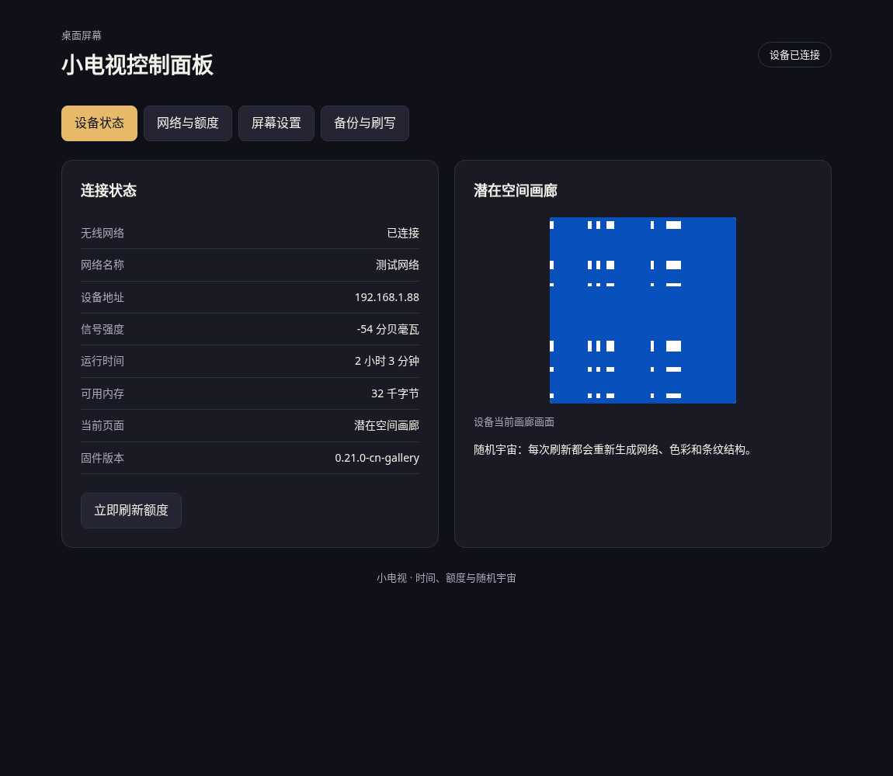
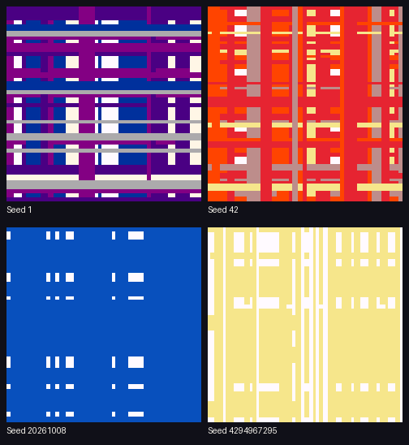

# 小电视：时间、额度与潜在空间画廊

适用于 **GeekMagic SmallTV-Ultra（ESP8266、4 MB 闪存、240×240 ST7789）** 的精简固件，基于 [Avinava/glimmer](https://github.com/Avinava/glimmer) 改造。

只保留四个屏幕页面：

| 页面 | 内容 |
|---|---|
| 时间与额度 | 本地时间、日期、反重力与 Codex 剩余额度、当天时间条 |
| 反重力额度 | 主要与次要额度、重置倒计时、24 小时额度记录 |
| 设备状态 | 网络地址、网络名称、信号、连接状态、运行时间、可用内存、固件版本 |
| 潜在空间画廊 | 每次重新生成随机网络、隐向量、颜色和横纵条纹 |

控制网页全部采用中文，分为“设备状态”“网络与额度”“屏幕设置”“备份与刷写”。可以轮播四页，也可以关闭自动轮播，固定显示一页。画廊只有**画面刷新间隔**一个专属设置，范围 1–86400 秒，默认 10 秒；不再提供成长、逐条过渡、逐维过渡、色板或轴向控制。设备隐藏画廊时不计算新画面，重新进入时按刷新间隔决定是否生成。

天气、预报、独立时钟、独立 Codex 页、综合额度页、推送卡片、MCP、生日与个性化问候、夜间亮度功能及相关设置和资源已移除。Codex 数据接入保留，因为时间与额度页需要它。

## 画面示例

下图是中文面板的浏览器验证截图；画廊图由与固件共用的引擎生成，并非实机拍照。





## 直接刷写

下载 [本仓库发布文件](https://github.com/ccawmiku/glimmer/releases)中的 `glimmer-0.21.0-cn-gallery.zip`，解压后按照 [中文刷写说明](FLASHING.md)操作。包中包含：

- `firmware.bin`：通过设备的固件上传入口刷写。
- `littlefs.bin`：通过设备的文件系统上传入口刷写，包含中文网页和所需字体。
- `flash-all.bin`：串口专用合并镜像，从 `0x0` 写入；不要上传到网页固件入口。
- `刷写说明.md`、`manifest.json`、`SHA256SUMS`。

**先刷固件，再刷文件系统。文件系统更新会清除设置，请先导出备份。** 两个文件必须来自同一次构建。

设备配网热点名称为 `glimmer-setup`，设置地址为 `http://192.168.4.1/`。正常连接后使用设备 IP 或 `http://glimmer.local/`。无线网络仅支持 2.4 GHz。北京时间默认偏移为 480 分钟，UTC 填 0；旧版备份的小时偏移会迁移为分钟偏移。

## 画廊移植

来源是较新的 [ccawmiku/latent-art-wallpaper 的 dev 分支](https://github.com/ccawmiku/latent-art-wallpaper/tree/dev)，固定采用原版默认的横纵条纹、自动遮盖顺序、经典 32 色自动选色。保留完整 `192→96→64→64` 随机解码网络，权重通过种子即时重建，不在设备中常驻 112 KB 的权重矩阵。每行只需 480 字节缓冲，避免分配 115 KB 的全屏缓冲区，也避免先清屏再画条纹造成闪白。

网页预览读取设备生成的条纹描述，展示设备当前实际生成的画廊画面。[移植评估与验证记录](docs/GALLERY_PORT.md)说明了内存占用、参照验证和实机验证边界。

## 从源码构建

```bash
python -m pip install platformio
python -m platformio run -e nodemcuv2
python -m platformio run -e nodemcuv2 -t buildfs
python tools/package.py
```

输出在 `dist/`。硬件平台和两项固件依赖已固定版本；网页无需构建、外部 CDN 或额外运行库。

画廊对照测试需要 Python、Node.js 和 g++：

```bash
python tests/verify_gallery.py
```

中文网页的浏览器交互验证额外需要开发依赖：

```bash
npm ci
npx playwright install chromium
npm run test:web
```

浏览器测试模拟设备 API，用于验证网页行为；不会声称已经访问物理设备。测试输出截图保存在 `artifacts/`。神经网络和渲染对照直接执行与固件共用的 C++ 实现，与保留的上游 JavaScript 模块比较。

## 许可

保留原 glimmer 的 MIT 许可。画廊模块来自 CCAW 的 MIT 项目，归属与许可证见 [第三方说明](THIRD_PARTY.md)和 [参照模块许可证](tests/reference/LICENSE)。
