<p align="center">
  
</p>

# glimmer

> A pixel-art desk display for people who live in coding agents. Custom
> firmware for the **GeekMagic SmallTV-Ultra** (ESP8266, 240×240) that shows
> your Antigravity and Codex usage at a glance — and taps you on the shoulder when
> an agent is **waiting for your approval**.

<p align="center">
  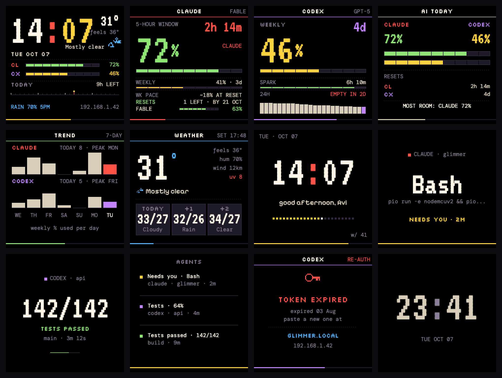
</p>

<sub>Screens rendered from the firmware's layouts, palette and fonts.</sub>

## What it does

- **Usage you can trust at a glance.** Claude's 5-hour and weekly windows,
  per-model limits and reset credits; Codex's weekly window, per-model limit
  and credits; a combined AI view that tells you which allowance to spend next;
  a 7-day trend of how much you burn per day.
- **Pace, not just percentages.** "EMPTY IN 2D" or "~18% AT RESET", worked out
  from a week of on-device history.
- **Approvals on your desk.** When Claude Code or Codex stops at a permission
  prompt, glimmer shows what it wants to run and how long it has been waiting
  — and clears itself once you answer in the terminal.
- **Honest about its own data.** Old numbers dim with a `STALE 14M` badge; an
  expired or rejected token gets a screen that says so and where to fix it; a
  Codex token warns you three days before it expires.
- **A calm desk object.** Clock, weather (rain hint, UV, sunrise/sunset), a dim
  night face or screen-off at night, and no animations between channels.

Everything is set up from a small web UI on the device (`http://glimmer.local`).

## Channels

| | Channel | Shows |
|---|---|---|
| 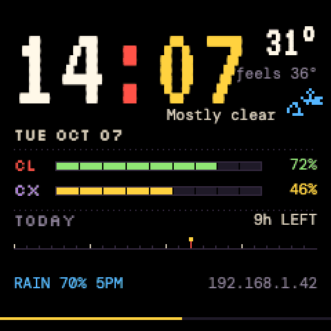 | **Home** | Clock, weather, Claude/Codex meters, today's timeline, rain hint |
| 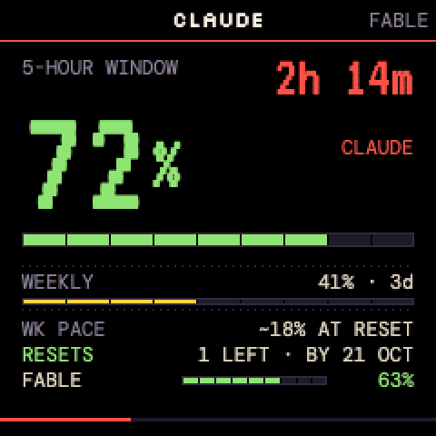 | **Claude** | 5-hour (or weekly) hero %, reset countdown, weekly row, pace, reset credits, per-model limits |
| 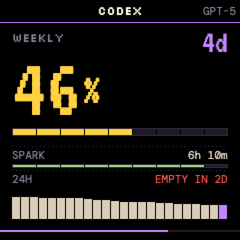 | **Codex** | Weekly hero %, credits or reset, per-model limit, 24-hour history with pace |
| 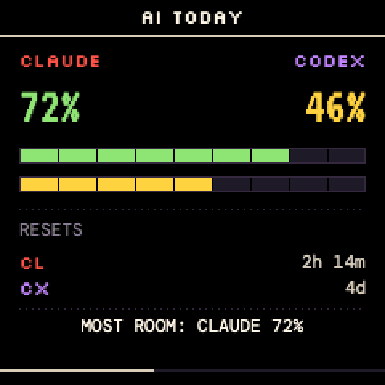 | **AI today** | Both side by side, their resets, and which one to use next |
| 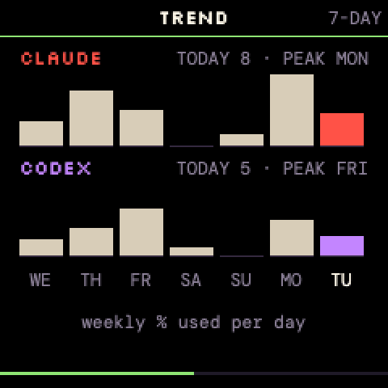 | **Trend** | Weekly allowance used per day, last 7 days, per provider |
| 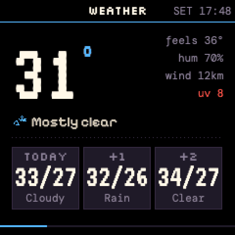 | **Weather** / **Forecast** | Temperature, feels-like, humidity, wind, UV, next sunrise/sunset; 3-day range bars |
| 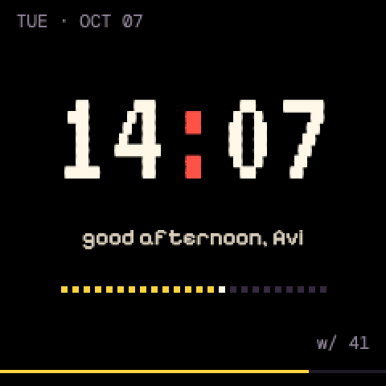 | **Clock** | Big clock (12/24 h), greeting, day progress |
| 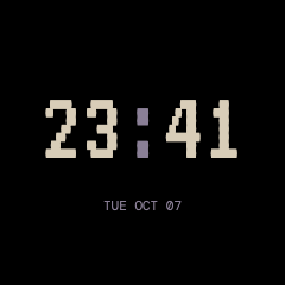 | **Night face** | Dim time and date only, during your night window (optional) |

Plus **Info** (network, memory, firmware) and a **Setup** checklist that
appears until you add a key.

## glimmer for agents

<p align="center">
  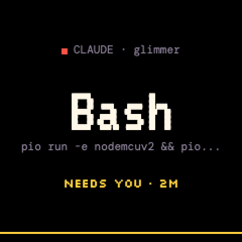
  &nbsp;
  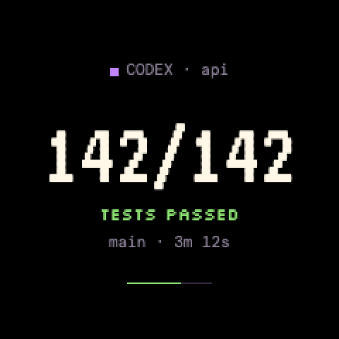
  &nbsp;
  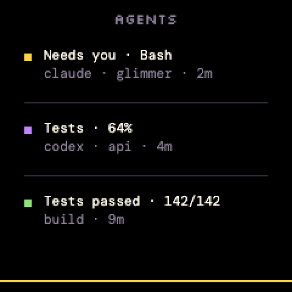
</p>

The moment an agent stops at a permission prompt, glimmer shows **which
agent**, **which project**, **what it wants to run** and **how long it has
waited**. The card holds the screen and the strip along the bottom turns amber
on every channel. When you answer in the terminal, the card goes away. The
device has no buttons — you always approve in the terminal; glimmer just makes
sure you notice.

Agents can also push their own cards over MCP or HTTP: progress that updates in
place, "tests passed", "deploy failed". Up to five cards queue by priority; the
**Agents** channel lists them.

**Set up in three steps** (the device's **Agents** tab shows these with your
URL and token filled in):

1. **Hook script** — install
   [`tools/agents/glimmer-hook.sh`](tools/agents/glimmer-hook.sh) to
   `~/.local/bin/` (needs `curl` and `jq`), and set
   `GLIMMER_URL=http://glimmer.local` (plus `GLIMMER_TOKEN` if you set an API
   token on the device).
2. **Wire the hooks** — merge
   [`tools/agents/claude-settings.json`](tools/agents/claude-settings.json) into
   `~/.claude/settings.json`, and/or save
   [`tools/agents/codex-hooks.json`](tools/agents/codex-hooks.json) as
   `~/.codex/hooks.json` (Codex asks you to trust new hooks once).
3. **MCP (optional)** — add [`tools/agents/mcp.json`](tools/agents/mcp.json) to
   your `.mcp.json`, or
   `claude mcp add --transport http glimmer http://glimmer.local/mcp`.

Then paste the short block from
**[docs/AGENTS-GLIMMER.md](docs/AGENTS-GLIMMER.md)** into your project's
`CLAUDE.md` / `AGENTS.md`. It tells agents when to push, how to update a card
in place and what never to send; the same doc is the full card and API
reference.

## When something's wrong

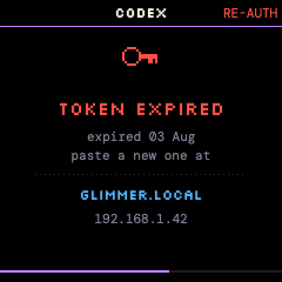

glimmer separates *"your key is dead"* from *"the network hiccuped"*:

- **No key yet** — a Setup checklist, and the Home rows say `add key · glimmer.local`.
- **Rejected or expired** — a card says so and where to paste a new one; old
  numbers stay visible, dimmed, with a banner. A token is only declared bad
  after two rejections in a row.
- **Blocked** — if claude.ai answers with a Cloudflare challenge instead of
  JSON, glimmer says the *device* is being challenged and that your key is fine.
- **Expiring** — Codex tokens carry an expiry date; glimmer warns three days
  ahead.
- **Offline** — numbers dim with `STALE 14M`; fetching backs off and retries.

Short notice cards ("CODEX TOKEN · 2 DAYS") appear once in a while for these —
never at night.

## The web UI

<p align="center">
  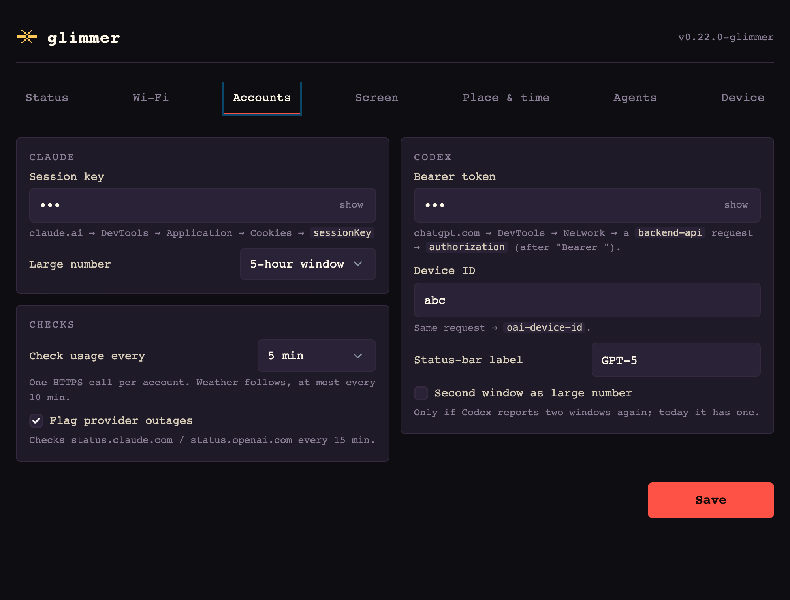
  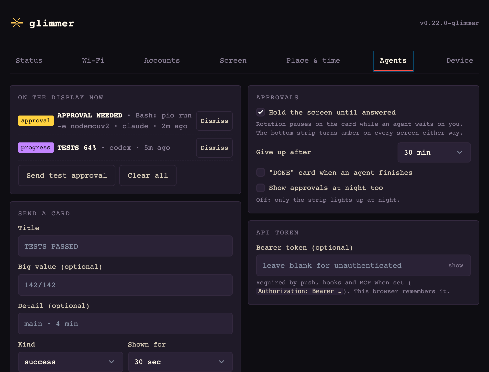
</p>

| Tab | What's there |
|---|---|
| **Status** | Live state, diagnostics (memory, per-source health, provider status), refresh, show a channel |
| **Wi-Fi** | Network credentials |
| **Accounts** | Antigravity token, Codex token (each with a live status line), which number is large, how often to check, outage badges |
| **Screen** | Channels (in rotation order, with what each needs), rotation, brightness, 12/24 h, night mode |
| **Place & time** | Your name, timezone, weather location and units |
| **Agents** | What's on the display, approval behaviour, send a card, API token, hook and MCP snippets |
| **Device** | Firmware update, config backup/restore, reboot, factory reset |

The optional API token (Agents tab) protects the agent endpoints — push,
hooks, MCP, refresh and channel switching. Settings, config export and the
firmware update page stay open to your LAN, and the export contains your
Wi-Fi password and keys, so keep glimmer on a network you trust.

## Getting your tokens

glimmer reads your usage the way the claude.ai and chatgpt.com dashboards do,
with your own browser session. Copy each credential from DevTools and paste it
on the **Accounts** tab at `http://glimmer.local/`.

**Claude — `sessionKey` cookie.** On `claude.ai`: DevTools → **Application →
Cookies → `https://claude.ai`** → copy `sessionKey` (starts with
`sk-ant-sid02-`). It has no visible expiry; glimmer tells you when claude.ai
stops accepting it.

**Codex — bearer token + device ID.** On `chatgpt.com`: DevTools → **Network**,
filter `backend-api`, click any request and copy two headers:
`authorization: Bearer eyJ…` (everything after `Bearer `) and `oai-device-id`.
Use a `backend-api` request — asset requests carry no `authorization` header.
The token is short-lived; glimmer reads its expiry and warns before it lapses.

> **Shortcut:** right-click the `backend-api` request → **Copy as cURL** and give
> it to Claude Code — it can pull both values out and send them to the device
> (`POST /api/settings`).

## Install

### Flash the prebuilt images (no toolchain)

Every push to `main` is built by CI and published to the rolling
**[`latest`](https://github.com/Avinava/glimmer/releases/tag/latest)** release
(each `v*` tag also gets its own release):

```bash
# Grab the latest CI-built images (or build locally)
curl -L -O https://github.com/ccawmiku/glimmer/releases/download/latest/firmware.bin
curl -L -O https://github.com/ccawmiku/glimmer/releases/download/latest/littlefs.bin

# Flash a freshly-stocked SmallTV-Ultra (over your home LAN). Firmware FIRST:
DEVICE_IP=<find via arp or device screen>
curl -F "firmware=@firmware.bin"   http://$DEVICE_IP/update
curl -F "filesystem=@littlefs.bin" http://$DEVICE_IP/update

# Device reboots into glimmer's setup AP. Connect to "glimmer-setup" Wi-Fi
# (open, no password) and visit http://192.168.4.1/ to enter your home
# Wi-Fi credentials.
```

- **Stock SmallTV-Ultra → glimmer:** see **[FLASHING.md](./FLASHING.md)**
  (get the stock firmware onto your Wi-Fi once, then OTA-flash the filesystem
  and the firmware). The device reboots into the open `glimmer-setup` Wi-Fi;
  join it and open `http://192.168.4.1/`.
- **Updating a glimmer:** firmware alone keeps your settings
  (`curl -F "firmware=@firmware.bin" http://glimmer.local/update`). A
  filesystem flash replaces `/config.json` — FLASHING.md shows how to carry your
  settings across without the setup-Wi-Fi detour.

### Let Claude Code do it

From a clone of this repo, run the `flash-device` skill:

```
> /skill flash-device
```

Or from anywhere, paste:

> Please flash glimmer onto my GeekMagic SmallTV-Ultra. Follow the skill at
> **https://github.com/ccawmiku/glimmer/blob/main/.claude/skills/flash-device.md**:
> detect whether the device is stock or already on glimmer, verify every step
> (curl `/api/state`), use the prebuilt
> [`latest`](https://github.com/ccawmiku/glimmer/releases/tag/latest) images,
> flash firmware first, keep my settings, and confirm with me before each step.
> My device is `<next to me / at <ip> / glimmer.local>`; my OS is `<macOS / Linux / Windows>`.

## Hardware

- **MCU:** ESP8266 at 160 MHz, about 30 KB of free RAM
- **Display:** 240×240 ST7789 IPS (needs colour inversion; the web UI has a
  toggle in case your panel differs)
- **Backlight:** PWM on GPIO5, active-low
- **Flash:** 4 MB — firmware slot about 1 MB (room for over-the-air updates),
  1 MB LittleFS for fonts, the web UI and settings
- **USB-C:** power only · **Wi-Fi:** 2.4 GHz only

On this little chip a secure (TLS) request needs about 25 KB, so glimmer
drops the VLW font cache before TLS calls (`Display::releaseFont()`),
fetches one source at a time only when there's enough free memory, and keeps
everything else lean.

## Development

```bash
pio run -e nodemcuv2              # firmware
pio run -e nodemcuv2 -t buildfs   # filesystem (fonts + web UI)
pio test -e native                # host tests: parsers, backoff, credentials, history, attention queue
```

- **Fonts** are pre-built VLW bitmaps in `data/fonts/` (ASCII plus `°` and `·`).
  To change them, edit `FONT_MATRIX` in `tools/genfonts.py` and run it with
  `python tools/genfonts.py --out <dir>` — or the `regenerate-fonts` skill.
- **Add a channel:** create `src/channels/ch_<name>.cpp` with `chXxxEnabled`,
  `chXxxDraw` and an optional `chXxxTick`, and add a row to `kChannels[]` in
  `src/main.cpp`. `tick()` must only repaint what changed — see `ch_clock.cpp`.
- **Working on the code with an agent?** Start with **[AGENTS.md](AGENTS.md)**
  (orientation) and **[CLAUDE.md](CLAUDE.md)** (the hard-won rules).

### Getting your tokens

glimmer reads your usage by querying the Antigravity user quota API and
ChatGPT backend usage API. Set credentials on the Accounts tab in the device web UI:

- **Antigravity (Google OAuth Refresh Token):**
  Locate your local Antigravity OAuth token at `~/.gemini/antigravity-cli/antigravity-oauth-token`.
  Copy the `refresh_token` (`1//...`) or direct `access_token` (`ya29...`). Glimmer will automatically exchange the refresh token with Google OAuth and keep it renewed.
- **Codex (Bearer token + Device ID):**
  1. Open DevTools on `chatgpt.com` → **Network** tab.
  2. Filter for `backend-api` and click any request.
  3. Copy `authorization: Bearer <token>` and `oai-device-id: <uuid>`.
  4. Paste into Accounts tab under **Codex → Bearer token** and **Device ID**.

## Disclaimer — personal & educational use only

glimmer is shared for **personal experimentation and educational purposes**.

It reads your own Antigravity and Codex usage by sending **your own credentials** (an
OAuth token for Antigravity, a Bearer token for chatgpt.com) to endpoints
powering usage statistics. **These endpoints may change without notice.** Accessing them programmatically may be
inconsistent with Google's or OpenAI's Terms of Service depending on
interpretation.

By installing or modifying this firmware you accept full responsibility for:

- Your own compliance with the relevant Terms of Service.
- Anything that happens on your own devices, accounts, or network.
- Securing your credentials — they are stored on the device's LittleFS partition
  in plaintext (the device runs on your home Wi-Fi behind your router).

This is a hobbyist project shared as-is, with no warranty, no support guarantee,
and no claim of fitness for any particular purpose. **Do not redistribute as a
commercial product. Do not use this to access accounts that are not yours.**

## License

MIT. See [LICENSE](./LICENSE). The MIT license governs the code in this
repository; it does **not** waive any obligations you may have under third-party
Terms of Service (Anthropic, OpenAI, etc.). See the Disclaimer above.

## Acknowledgments

- Inspired by [Clawdmeter](https://github.com/HermannBjorgvin/Clawdmeter) by Hermann Björgvin.
- GeekMagic SmallTV-Ultra — the hardware.
- [TFT_eSPI](https://github.com/Bodmer/TFT_eSPI) — display driver.
- [VT323](https://fonts.google.com/specimen/VT323),
  [Silkscreen](https://fonts.google.com/specimen/Silkscreen),
  [DM Mono](https://fonts.google.com/specimen/DM+Mono),
  [Pixelify Sans](https://fonts.google.com/specimen/Pixelify+Sans)
  — typography (all OFL).

---

<p align="center">
  <sub>Designed and built with <a href="https://claude.com/code">Claude Code</a>.</sub>
</p>
